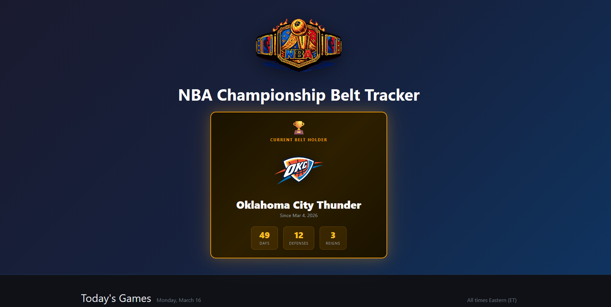

# NBA Championship Belt Tracker



The NBA championship belt works like a boxing title — the defending champion holds the belt at the start of each season. Any team that beats the belt holder takes it. Track who holds it, how long they've held it, and which games have the belt on the line.

## Features

- **Live belt holder card** — current team, days held, total defenses, and reigns this season
- **Today's games** — live from the Ball Don't Lie API, flagged if the belt is on the line
- **Historical game data** — full season of completed games stored locally with belt context
- **Belt history** — full chain of custody tracked game by game

## Tech Stack

- **PHP 8.2** with Slim Framework
- **SQLite** for local game and belt history storage
- **nginx + php-fpm** managed by supervisord in a single Docker container
- **Ball Don't Lie API** for live game data
- **Bootstrap 5** on the frontend

## Running Locally

**Prerequisites:** Docker Desktop

1. Clone the repo
2. Copy `.env.example` to `.env` and add your Ball Don't Lie API key:
   ```
   BALLDONTLIE_API_KEY=your_key_here
   ```
3. Start the app:
   ```bash
   docker compose up --build
   ```
4. Visit [http://localhost:8080](http://localhost:8080)

On first run the container seeds the full current season from the API — this may take a minute.

## API Endpoints

| Method | Endpoint | Description |
|--------|----------|-------------|
| GET | `/api/belt/holder` | Current belt holder with stats |
| GET | `/api/games/today` | Today's games enriched with belt context |
| GET | `/api/games/{date}` | Games from a specific date (YYYY-MM-DD) |
| GET | `/api/games/belt` | All belt games for the current season |
| GET | `/api/teams` | All active NBA teams |

## Deployment

Deployed on [Railway](https://railway.app) with a persistent volume for the SQLite database. Environment variables (`BALLDONTLIE_API_KEY`, `DB_PATH`) are configured in the Railway dashboard.
